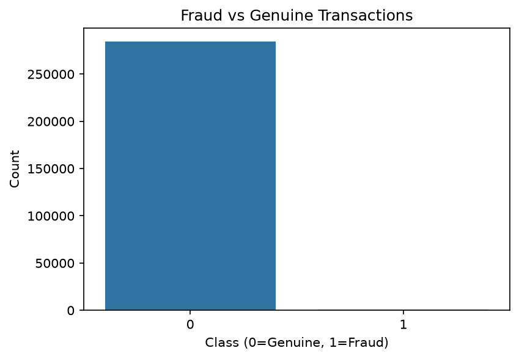
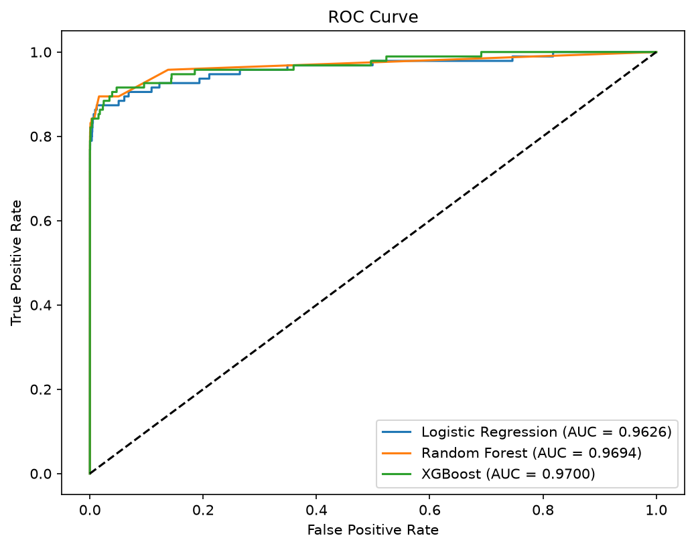
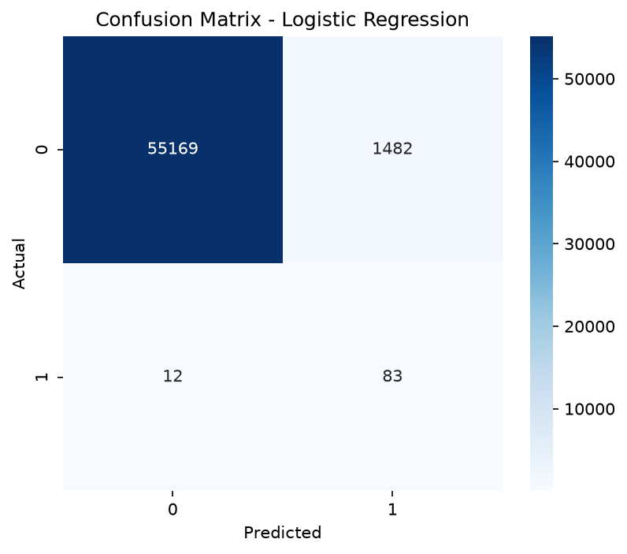
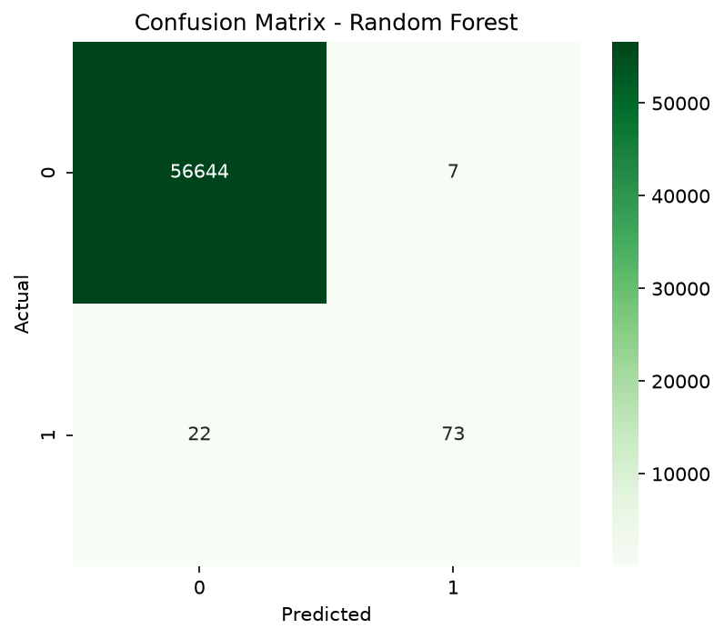
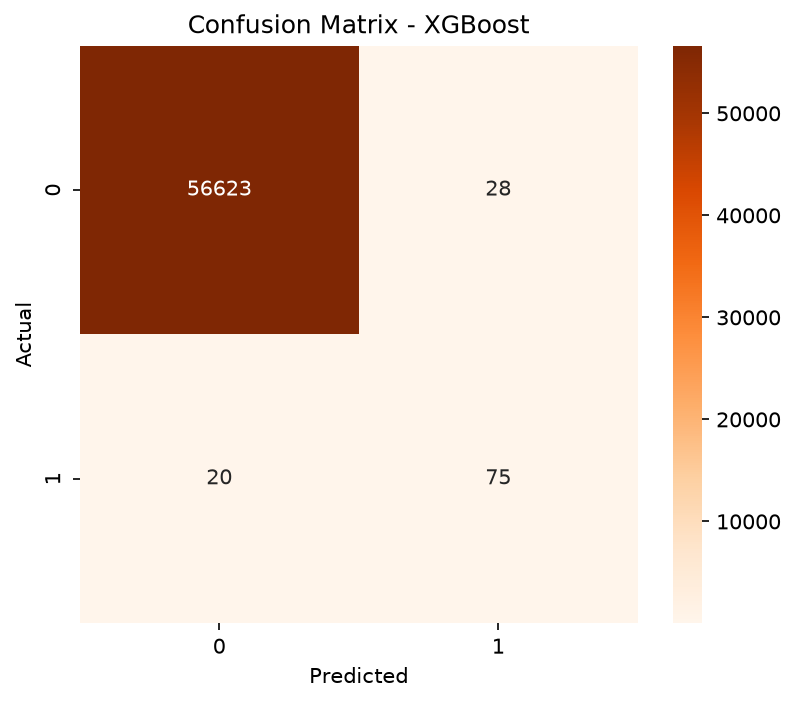

# Credit Card Fraud Detection

This is my machine learning project where I tried to detect fraudulent credit card transactions. I made this project to learn how ML works on real world data.

---

## About

So the problem is that fraud transactions are very rare in the dataset, only around 0.17% of all transactions are fraud. Because of this the dataset is highly imbalanced and normal models will just predict everything as genuine and still get 99% accuracy which is wrong.

To fix this I used SMOTE to balance the training data and then trained 3 different models and compared them.

---

## Dataset

I used the Credit Card Fraud Detection dataset from Kaggle.

- Total rows: 284,807
- Fraud cases: 492
- Genuine cases: 284,315

The features are mostly PCA components (V1 to V28) so I dont know what they actually represent. There is also Time, Amount and Class column.

---

## Project Folder Structure

```
Credit_Card_Fraud_Detection/
│
├── dataset/
│   └── creditcard.csv
├── notebook/
│   └── Credit_Card_Fraud_Detection.ipynb
├── image/
├── models/
├── report/
├── requirements.txt
├── README.md
└── .gitignore
```

---

## What I did step by step

1. Loaded the dataset and explored it
2. Checked null values and duplicates (there were 1081 duplicate rows, removed them)
3. Plotted class distribution, amount and time graphs
4. Scaled the features using StandardScaler
5. Split data into train and test (80/20)
6. Applied SMOTE only on training data to balance classes
7. Trained 3 models
8. Evaluated and compared all models
9. Saved the models

---

## Models

I used these 3 models:
- Logistic Regression
- Random Forest
- XGBoost

---

## Results

| Model | Accuracy | Precision | Recall | F1 Score |
|---|---|---|---|---|
| Logistic Regression | 0.9737 | 0.0530 | 0.8737 | 0.1000 |
| Random Forest | 0.9994 | 0.8875 | 0.7474 | 0.8114 |
| XGBoost | 0.9947 | 0.2192 | 0.8421 | 0.3478 |

Random Forest gave the best F1 Score so I picked it as the best model.

I also learned that for fraud detection recall is more important than accuracy because missing a fraud transaction is worse than flagging a genuine one.

---

## Graphs

### Class Distribution


### ROC Curve


### Confusion Matrix - Logistic Regression


### Confusion Matrix - Random Forest


### Confusion Matrix - XGBoost


---

## Libraries used

- pandas
- numpy
- matplotlib
- seaborn
- scikit-learn
- xgboost
- imbalanced-learn
- joblib

---

## How to run

First clone the repo and install requirements:

```bash
git clone <your repo link>
cd Credit_Card_Fraud_Detection
pip install -r requirements.txt
```

Then download the dataset from Kaggle and put creditcard.csv inside the dataset folder.

Then open the notebook and run all cells.

---

## What I learned from this project

- how to handle imbalanced data using SMOTE
- why accuracy is not always a good metric
- difference between precision and recall
- how to compare multiple models
- how to save models using joblib

---

## Future ideas

- try hyperparameter tuning
- make a simple web app using streamlit
- try other models like SVM or LightGBM

---

## About me

I am Shreya Gupta, a B.Tech Computer Science student. I built this project to improve my understanding of machine learning, practice working with real-world datasets, and strengthen my practical skills by implementing different ML models from scratch.
